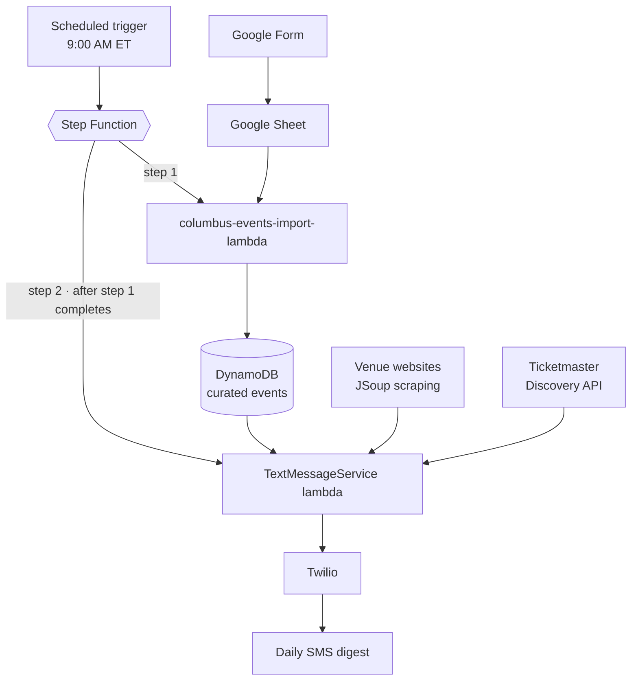

# Columbus Events Alert Service

Serverless Java application that aggregates Columbus-area events from three sources — Ticketmaster's Discovery API, venue web scraping, and a DynamoDB table of manually curated entries — and delivers a personalized daily SMS digest via Twilio. Designed, built, and maintained solo. Live in production since September 2024.

Every morning at 9:00 AM Eastern it answers two questions: **what's happening today that I'd want to go to**, and **what's happening today that I should drive around**.

---

## What it does

Each run collects every event dated for that day and sends a single SMS covering both categories:

- **Events I'm interested in** — concerts, sports games, festivals worth knowing about.
- **Events likely to cause traffic** — large gatherings near routes I drive, so I know what to avoid.

That second category is the reason the project exists. Plenty of apps will tell you what's on; almost none tell you that 40,000 people are about to converge on a stadium between you and the grocery store.

---

## How it works



The Step Function runs the two Lambdas in order rather than in parallel: the import step syncs any newly submitted events from the Google Sheet into DynamoDB, and only once it completes does the digest Lambda run. That ordering means an event added to the form the night before still makes it into the next morning's text.

### The three sources

Each one covers a category of event the others miss:

| Source | Covers | Examples |
|---|---|---|
| **DynamoDB** (manually curated) | Events that occur infrequently that can be difficult to scrape | ComFest, Cap City Marathon, OSU Move-In Day |
| **Venue scraping** (JSoup) | Small and mid-size venues without public APIs | KEMBA Live!, Ace of Cups |
| **Ticketmaster Discovery API** | Large ticketed venues | Crew Stadium, Ohio Stadium, Convention Center |

The manual-entry path exists for Columbus events that are either not available or not frequent enough for web scraping. A Google Form writes to a Google Sheet, and the import Lambda — step one of the state machine — moves new rows into DynamoDB before the digest is assembled. It's a low-friction way to add an event from my phone without touching the database directly.

---

## Tech stack

**Language:** Java
**AWS:** Lambda, Step Functions, DynamoDB, CodePipeline
**Integrations:** Twilio (SMS), Ticketmaster Discovery API, Google Forms/Sheets
**Libraries:** JSoup (HTML scraping)

---

## Running it

### Lambda entry point

```
com.ColumbusEventAlertService.services.TextMessageService::sendTodaysEvents
```

### Running locally

The application supports local execution through logic in the `main` method. Add a program argument named `localRun` to your run configuration:

```
localRun
```

---

## Notes from running it in production

Two years of unattended operation has mostly been a lesson in other people's failure modes:

- **Third-party APIs go down.** A failed source degrades the digest rather than killing the run — a missing category is better than no text at all.
- **Scrapers break without warning.** Venue sites redesign on their own schedule, so scraping failures are handled as an expected condition, not an exception.

---

## Why it exists

A pet project, honestly — I wanted to know what was happening in my city, and I wanted something of my own running in production that I'd have to keep alive. It has been a better teacher than any tutorial: nothing sharpens your instinct for defensive coding quite like a text message that doesn't arrive.
